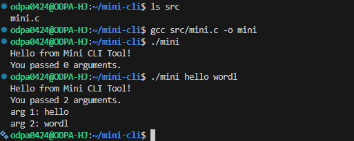
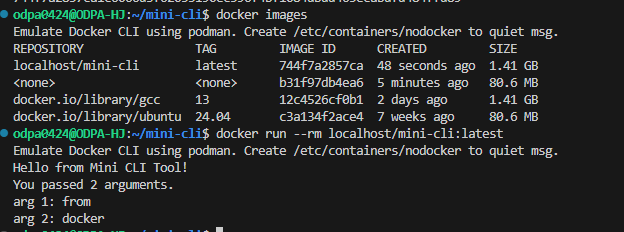

# Mini CLI Tool 프로젝트

이 프로젝트는 리눅스 환경에서 간단한 C 기반 CLI 프로그램을 작성하고,  
이를 Docker 이미지로 빌드하여 컨테이너에서 실행하는 전체 과정을 실습하기 위한 미니 프로젝트입니다.  

프로그래밍 자체는 간단하지만,  
**오픈소스 개발 흐름(작성 → 실행 → Docker 패키징 → GitHub 배포)** 을 경험하는 것이 핵심 목표입니다.

---

## 📁 1. 프로젝트 구조

```

mini-cli/
├─ src/
│   └─ mini.c
├─ Dockerfile
├─ README.md
├─ LICENSE
└─ docs/
└─ images/
├─ linux_run.png
└─ docker_run.png

````

---

## 🖥️ 2. Mini CLI 프로그램 소개

프로그램은 전달된 인자를 출력하는 간단한 CLI 도구입니다.

### `src/mini.c`

```c
#include <stdio.h>

int main(int argc, char *argv[]) {
    printf("Hello from Mini CLI Tool!\n");
    printf("You passed %d arguments.\n", argc - 1);

    for (int i = 1; i < argc; i++) {
        printf("arg %d: %s\n", i, argv[i]);
    }

    return 0;
}
````

---

## 🐧 3. Linux 환경에서 빌드 및 실행 (WSL 사용)

이 실습은 Windows 환경의 WSL2(Ubuntu)를 사용하여 진행했습니다.

### 3-1. 패키지 업데이트 및 gcc 설치

```bash
sudo apt update
sudo apt install -y gcc
```

### 3-2. 컴파일

```bash
cd ~/mini-cli
gcc src/mini.c -o mini
```

### 3-3. 실행

```bash
./mini
./mini hello world
```

### 실행 결과 캡처



---

## 🐳 4. Docker 이미지 빌드 및 실행

WSL 환경에서 `docker` 명령은 `podman`을 에뮬레이션하여 실행되었습니다.
(GitHub 제출 시 문제가 없으며, 컨테이너 실행 로그는 정상 출력됨)

### 4-1. Dockerfile

```Dockerfile
FROM docker.io/library/gcc:13

WORKDIR /app

COPY src/mini.c .

RUN gcc mini.c -o mini && \
    rm mini.c

CMD ["./mini", "from", "docker"]
```

---

### 4-2. Docker 이미지 빌드

```bash
cd ~/mini-cli
docker build -t localhost/mini-cli:latest .
```

### 4-3. Docker 컨테이너 실행

```bash
docker run --rm localhost/mini-cli:latest
```

### 실행 결과 캡처



---

## 🌿 5. Git Workflow (커밋/브랜치 관리)

과제 요구사항에 따라 다음과 같은 Git 흐름을 사용했습니다.

### ✔ 최소 5회 커밋

### ✔ feature/docs 브랜치를 생성해 문서 및 이미지 작업 후 main에 merge

#### Git 작업 요약

```bash
git init
git add README.md LICENSE
git commit -m "Add initial project structure"

git add src/mini.c
git commit -m "Add mini CLI source code"

git add Dockerfile
git commit -m "Add Dockerfile"

git checkout -b feature/docs
git add README.md
git commit -m "Improve README documentation"

git add docs/images/
git commit -m "Add screenshots for Linux and Docker execution"

git checkout main
git merge feature/docs
```

---

## 📌 6. 마무리

이 프로젝트를 통해 다음 과정을 직접 경험했습니다.

* 리눅스 환경에서 개발 도구(gcc) 설치
* 간단한 CLI C 프로그램 작성 및 실행
* Dockerfile 구성 및 컨테이너 이미지 빌드
* Podman 기반 docker 실행 환경에서 컨테이너 실행
* Git 커밋/브랜치/머지 및 GitHub 배포

이 저장소 자체가 과제 제출용 리포트 역할을 합니다.

---

## 📎 License
Distributed under the MIT License.
See `LICENSE` file for details.
